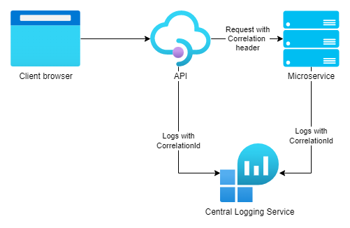

# CRIP AspNetCore Correlation


The correlation ID is distributed tracing mechanism meant to be used to help Admin trace what was happening at the time
of an error/request. It is only valuable as an interactive tool to help the Admin track down your error. An Admin uses
the correlation ID as "breadcrumbs" to retrace a requests or processes in the Logging System to find what leads up to
and causes a problem.



## Installation

Install [Crip.Extensions.Correlation NuGet package](https://www.nuget.org/packages/Crip.Extensions.Correlation),
or [GitHub package](https://github.com/orgs/crip-home/packages?repo_name=Crip.Extensions.Correlation)

## Setup

Configure services:

```csharp
services.AddHttpContextAccessor(); // package requires that HTTP context accessor is available
services.AddCorrelation();
```

Configure pipeline:

```csharp
// Add middlewares as early as possible
app.UseCorrelation();
// or
app.UseMiddleware<CorrelationIdMiddleware>();
app.UseMiddleware<CorrelationIdLoggingMiddleware>();
```

## HTTP client correlation

Correlation makes sense only when entire system is using same Correlation ID. To do so, you can use "traced" HTTP client
witch will automatically add header to all outgoing requests.

```csharp
services.AddTracedHttpClient<TClient, TImplementation>(((provider, client) =>
{
    var config = provider.GetRequiredService<IOptions<TClientOptions>>().Value;
    client.BaseAddress = new Uri(config.BaseUrl);
}));
```

## Correlation outside of ASP.NET request context

To simplify managing correlation contexts, the `ICorrelationManager` can be used. It takes care of the logic to create
the context properly. This is especially useful when running background tasks, console apps, Windows services, etc.
which need to interact with external services. Think of message broker handlers, scheduled task runners, etc.

```csharp
public class MyBackgroundService : BackgroundService
{
    private readonly ILogger<MyBackgroundService> _logger;
    private readonly ICorrelationManager _correlation;
    private readonly ITestControllerClient _client;

    public MyBackgroundService(
        ILogger<MyBackgroundService> logger,
        ICorrelationManager correlation,
        ITestControllerClient client)
    {
        _logger = logger;
        _correlation = correlation;
        _client = client;
    }

    protected override async Task ExecuteAsync(CancellationToken stoppingToken)
    {
        _logger.LogDebug("Background task before use"); // No correlation context logged

        await _correlation.Use("some-test-correlation-001", async () =>
        {
            _logger.LogDebug("Background task after set");

            var result = await _client.Test();

            _logger.LogDebug("response: {@Result}", result);
        });

        _logger.LogDebug("Background task after use");
    }
}
```

## Customization

You can customize correlation by providing custom options:

```csharp
services.Configure<CorrelationIdOptions>(options =>
{
    options.Cookie = "X-Correlation-Id"; // name of the cookie key to use as correlation identifier
    options.Header = "X-Correlation-Id"; // name of the HTTP request/response header
    options.PropertyName = "CorrelationId"; // name of the loggable property
    options.IncludeInResponse = true; // include correlation identifier header in responses
});
```

## Alternatives for more advanced Distributed Tracing

Please consider that .NET Core 3.1 and up now has built-in support
for [W3C TraceContext](https://github.com/w3c/trace-context) ([blog](https://devblogs.microsoft.com/aspnet/improvements-in-net-core-3-0-for-troubleshooting-and-monitoring-distributed-apps/))
and that there are other distributed tracing libraries with more functionality:

- [OpenTelemetry](https://opentelemetry.io/)
- [Jaeger](https://www.jaegertracing.io/)
- [Application Insights](https://docs.microsoft.com/en-us/azure/azure-monitor/app/app-insights-overview)